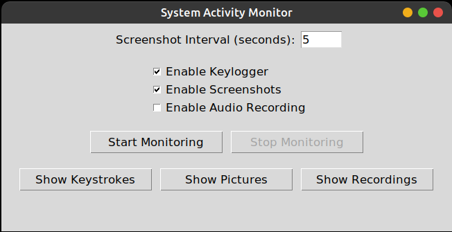

# System Activity Monitor

A comprehensive Python-based application designed to monitor and log system activities, including keystrokes, screenshots, and audio recordings. The application features a user-friendly graphical interface built with Tkinter, enabling users to manage monitoring tasks, view logs, and handle recordings with ease.



## Table of Contents

- [Features](#features)
- [Project Structure](#project-structure)
- [Installation](#installation)
- [Usage](#usage)
- [Detailed Module Descriptions](#detailed-module-descriptions)
- [Dependencies](#dependencies)
- [Contributing](#contributing)
- [License](#license)
- [Contact](#contact)
- [Acknowledgements](#acknowledgements)

## Features

- **Keylogger**: Captures and logs all keystrokes in real-time
- **Screenshot Capture**: Periodically takes screenshots based on user-defined intervals
- **Audio Recording**: Records audio from the system's microphone
- **Graphical User Interface (GUI)**: Intuitive interface built with Tkinter for easy navigation and control
- **Log Viewing**: Access and review logs of keystrokes and system activities
- **Media Management**: View, export, and delete screenshots and audio recordings directly from the application
- **Threaded Monitoring**: Efficient monitoring using multi-threading to ensure responsive UI

## Project Structure

```
.
├── activity_snapshots/    # Stores all captured screenshots
├── audio_recordings/      # Contains all audio recording files
├── logs/                  # Logs system activities, including keystrokes and errors
└── src/
    ├── audio_recordings_viewer.py
    ├── gui.py
    ├── keystrokes_log_viewer.py
    ├── main.py
    ├── screenshots_viewer.py
    └── system_monitor.py
```

## Installation

1. **Clone the Repository**

2. **Create a Virtual Environment**
   ```bash
   python -m venv venv
   source venv/bin/activate  # Linux/Mac
   # or
   .\venv\Scripts\activate   # Windows
   ```

3. **Install Dependencies**
   ```bash
   pip install -r requirements.txt
   ```

## Usage

### Running the Application

Start the application by executing the main script:
```bash
python src/main.py
```

### Quick Start Guide

1. **Start Monitoring**
   - Launch the application
   - Configure screenshot interval in seconds
   - Select desired monitoring features
   - Click "Start Monitoring"

2. **Stop Monitoring**
   - Click "Stop Monitoring" to end all monitoring activities

3. **View Logs and Recordings**
   - Access keystrokes via "Show Keystrokes"
   - Manage screenshots through "Show Pictures"
   - Handle audio files using "Show Recordings"

4. **Managing Media**
   - **Screenshots**:
     - Browse captured screenshots
     - Select and delete multiple images
     - Export selected images
     - View full-size images
   
   - **Audio Recordings**:
     - Play selected recordings
     - Stop playback as needed

## Detailed Module Descriptions

### main.py
Entry point of the application. Initializes the Tkinter root window and launches the GUI.

### gui.py
Implements the main graphical user interface using Tkinter. Main components include:
- `MonitorGUI`: Main class managing the GUI layout and interactions
- Control buttons for starting/stopping monitoring
- Action buttons for accessing various viewers

### system_monitor.py
Manages all monitoring activities using multi-threading. Key functions:
- `start_monitoring()`: Initiates monitoring
- `stop_monitoring()`: Stops active monitoring
- `take_screenshot()`: Captures screenshots
- `start_audio_recording()`: Begins audio recording
- `stop_audio_recording()`: Ends audio recording

### screenshots_viewer.py
Handles screenshot management with functions for:
- Loading and displaying images
- Deleting selected screenshots
- Exporting screenshots
- Full-size image viewing

### audio_recordings_viewer.py
Manages audio recordings with capabilities for:
- Listing available recordings
- Playing selected audio
- Stopping playback

### keystrokes_log_viewer.py
Displays logged keystrokes with functions for:
- Listing log files
- Displaying selected logs

## Dependencies

Key requirements:
- Python 3.x
- Tkinter
- Pillow
- Pynput
- Simpleaudio
- SoundDevice
- SoundFile

## Contributing

1. Fork the repository
2. Create your feature branch (`git checkout -b feature/AmazingFeature`)
3. Commit your changes (`git commit -m 'Add some AmazingFeature'`)
4. Push to the branch (`git push origin feature/AmazingFeature`)
5. Open a Pull Request

## License

This project is licensed under the MIT License.

## Acknowledgements

- Built with Python and Tkinter
- Utilizes libraries: Pillow, Pynput, Simpleaudio, SoundDevice, and SoundFile
- Inspired by various system monitoring tools and projects
